# Star Tracker Report

**2026-09-06** | Total: **7717 stars** | Change: **+12**

> Compared to snapshot from 2026-09-05

## 📈 Star Trend

### By Repository

Individual Repository Charts

#### RapidAI/RapidOCR: 7717 ★ (+12)

## Repositories

| Repositories | Stars | Change | Trend |
|:-----------|------:|-------:|:-----:|
| [RapidAI/RapidOCR](https://github.com/RapidAI/RapidOCR) | 7717 | +12 | ⬆️ |

## Summary

- **Stars gained:** 12
- **Stars lost:** 0
- **Net change:** +12

## 🔮 Growth Forecast

**Aggregate Forecast**

| Method | Week 1 | Week 2 | Week 3 | Week 4 |
|:---|---:|---:|---:|---:|
| Linear Regression | 7741 | 7766 | 7790 | 7814 |
| Weighted Moving Average | 7754 | 7791 | 7827 | 7864 |

### By Repository

RapidAI/RapidOCR

**RapidAI/RapidOCR**

| Method | Week 1 | Week 2 | Week 3 | Week 4 |
|:---|---:|---:|---:|---:|
| Linear Regression | 7741 | 7766 | 7790 | 7814 |
| Weighted Moving Average | 7754 | 7791 | 7827 | 7864 |

---
*Generated by [GitHub Star Tracker](https://github.com/fbuireu/github-star-tracker) on 2026-09-06T01:58:28.481Z*

*Made with 🤘 by [Ferran Buireu](https://github.com/fbuireu)*

